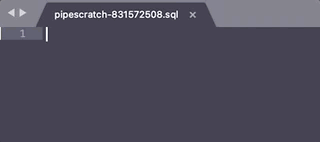

# pipescracth

Command pipescratch manages a scratch file as standard input/output for a
external command.

```
$ pipescratch -editor subl psql postgres
```



pipescratch runs a command and creates a temporary scratch file. Each time
the file is updated, its contents are passed to the command's standard
input. Each time the command writes to its standard output or error, the
file is appended a section at the end with the output as line comments.

```
Usage of pipescratch:
  -editor command
    	command to be invoked with the scratch file location as arg (empty just prints it)
  -ext extension
    	extension for scratch file (default "sql")
  -line-prefix string
    	prefix for each output line (default "-- ")
  [command] [arg1] [arg2] ...
    	command to manage input/output as a scratch file
```
